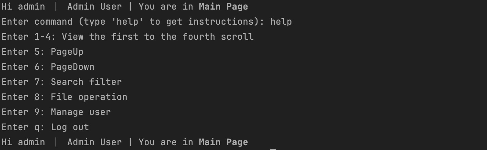

## Project Specification:

### Purpose and Scope

- Purpose:
    - The primary purpose of the Virtual Scroll Access System (VSAS) is to create a digital portal for the mystical realm of Edstemus. This portal will enable members of the 'Whiskers' guild, a revered group of computer science elves, to access, upload, and download the ancient digital scrolls of wisdom stored within the Library of Agility. These scrolls, represented as binary files, encapsulate a vast trove of digital knowledge. The VSAS project aims to provide an efficient system where admins and members can interact with these digital scrolls seamlessly.
- Scope:
    - 1.Target users:
        - Whiskers: Elite computer science elves in the field of Edstemus, leading digital scroll users.
        - Guest Users: Unregistered users who can browse but not upload or download scrolls.
        - Admin Users: Responsible for managing the overall system, including user administration and statistical data viewing, as well as managing and overseeing the overall content of the digital scroll.
    - 2.Usage scenario:
        - Knowledge retrieval: Whiskers members or library staff look up specific digital scrolls.
        - Digital scroll upload: Users share new digital scrolls.
        - Edit and update: The user who uploaded the scroll corrects or updates its content.
        - Scroll removal: The user removes scrolls that are no longer needed.
        - Preview and download: The user first previews the scroll content and then decides whether to download or not.
        - User management: The administrator performs the operation of adding and deleting users.
        - Statistics Viewing: The administrator views the statistics of the digital scroll.
        - User registration and login: registration of new users and login of existing users.
        - Visitor browsing: Visitors who are not logged in browse the available digital scrolls.
    - 3.Platform support:
        - Supports only the PC(windows,mac), not support other ports, such as mobile devices or web(html).
    - 4.Functional scope:
        - User management: registration, login, updating profile and password encryption.
        - Digital scroll management: Add, edit, update, and delete digital scrolls.
        - Scroll Seeker: View all scrolls, download scrolls, search filter by multiple parameters, and scroll preview.
        - Admin privileges: View all users, add and remove users, view statistics.
        - Flexibility and extensibility: The ability to adapt to changes in customer requirements and add new features.

### Technical Stack and Dependencies
- Java Version: Java 17.0.2
- Build Tool: Gradle 7.4
- Frameworks and Libraries: JUnit
- Database: SQLite
- Continuous Integration/Continuous Deployment (CI/CD): Jenkins
- Version Control and Collaboration: GitHub
- IDE: Intellij


## How to Run the Program:

### Prerequisites
    - Git
    - Java JDK (Version 17.0.2)
    - Gradle 7.4 (Use Gradle Wrapper)

### Steps:
#### 1.Clone the repository(clone the repository from GitHub to your local machine. Open your terminal and run):
```bash
git clone https://github.sydney.edu.au/SOFT2412-COMP9412-2023S2/Lab31-Mark-Group04-Assignment2.git
```
#### 2.Navigate to the project directory:
```bash
cd Lab31-Mark-Group04-Assignment2
```
#### 3.Running clean prevent old dependencies from interfering:
```bash
./gradlew clean #Unix
gradlew wrapper clean #Windows
```
#### 4.initial database:
```bash
./gradlew runInitDB #Unix
gradle wrapper runInitDB #Windows
```
#### 5.Run with Gradle Wrapper:
```bash
./gradlew run --console=plain   #Unix
gradle wrapper run --console=plain #Windows
```

### How to use Jacoco Test It:

```bash
./gradlew test jacocoTestReport #Unix
gradle wrapper test jacocoTestReport #Windows
```
- If you want to see Jacoco Report,you can follow path like this: ./app/build/report/jacoco/index.html
### Expectations for when you run and test it
#### If run this project we can got a User Interface like this:

#### For User Interface, you can use "help" to check each instruction,for different user type,you can see different features.
- For GuestUser

- For NormalUser

- For AdminUser


#### When use jacoco test this project,your terminal should like this picture:


## How to contribute/collaborate on GitHub repository:

### First time members should set up their own feature branch to make sure their code doesn't interfere with the main branch
```bash
git ckeckout main 
git pull 
git checkout -b <branch name>
```
### After creating it, first use this code:
- This code adds all the modified files to the staging area
```bash
git add .
```

### Use the following code to commit your changes and mark them
- e.g."fix main code"
```bash
git commit -m "fix main code"
```

### Use this code to push all changes to the remote branch repository

```bash
git push -u origin  <branch name>
```

### Then we need checkout main
- Pull the latest changes from main and merge with the current branch (local merge). If there is a merge conflict, please resolve the merge first.
```bash
git checkout main
git pull 
```
### How to do a merge
- When all conflicts are resolved, switch back to your own branch
```bash
git checkout <branch name>
```
- Then merge main with the current branch
```bash
git merge main
```
- It is uploaded to the remote branch repository again to realize the update of the remote branch repository
```bash
git push origin <branch name>
```
- After that,back to main
```bash
git checkout main
```
- Merge your own branch to main
```bash
git merge <branch name>
```
- Finally,Update code to main
```bash
git push origin main
```