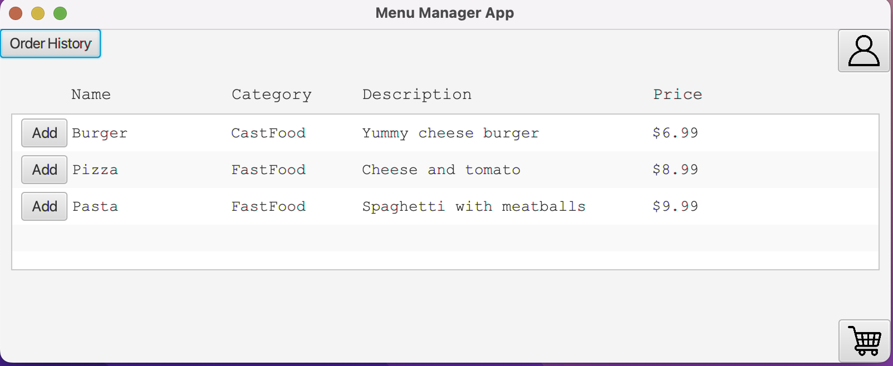
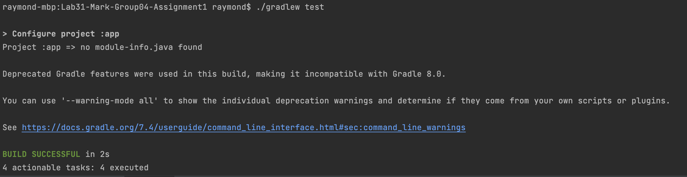

## Project Specification:

### Purpose and Scope

- Purpose:
  - 1.Provide an intuitive, user-friendly graphical interface, so that customers can easily and quickly order.
  - 2.Increase the efficiency of single processes and reduce manual errors.
  - 3.All data entry management systems can be quickly accessed and modified by the Admin.
- Scope:
  - 1.Target users:
    - Customers of restaurants, coffee shops and other business places that require a la carte service.
  - 2.Usage scenario:
    - Suitable for self-pickup and delivery ordering scenarios.
  - 3.Platform support:
    - Supports only the PC(windows,mac), not support other ports, such as mobile devices or web(html).
  - 4.Functional scope:
    - Browse the menu item list.
    - Select menuitem and these quantity, then add to cart.
    - View order summary and total price.
    - Customer can view history orders through the search box.
    - Multiple payment options are available.
    - Multiple delivery options are available.
    - Customer can register
    - Admin and Customer can log in.
    - Admin can modify the menu list.
    - Admin can query all orders.

### Technical Stack and Dependencies
- Java Version: Java 17.0.2
- Build Tool: Gradle 7.4
- Frameworks and Libraries: JUnit
- Database: SQLite
- Continuous Integration/Continuous Deployment (CI/CD): Jenkins
- Version Control and Collaboration: GitHub
- IDE: Intellij


## How to Run the Program:

### Prerequisites
    - Git
    - Java JDK (Version 17.0.2)
    - Gradle 7.4 (Use Gradle Wrapper)

### Steps:
#### 1.Clone the repository(clone the repository from GitHub to your local machine. Open your terminal and run):
```bash
git clone https://github.sydney.edu.au/SOFT2412-COMP9412-2023S2/Lab31-Mark-Group04-Assignment1.git
```
#### 2.Navigate to the project directory:
```bash
cd Lab31-Mark-Group04-Assignment1
```
#### 3.Running clean prevent old dependencies from interfering:
```bash
./gradlew clean #Unix
gradlew wrapper clean #Windows
```
#### 4.initial database:
```bash
./gradlew runInitDB #Unix
gradle wrapper runInitDB #Windows
```
#### 5.Run with Gradle Wrapper:
```bash
./gradlew run    #Unix
gradle wrapper run  #Windows
```

### How to Test It:

```bash
./gradlew test #Unix
gradle wrapper test #Windows
```

### Expectations for when you run and test it
#### If run this project we can got a User Interface(GUI) like this:

###

#### When test this project,your terminal should like this picture:


## How to contribute/collaborate on GitHub repository:

### First time members should set up their own feature branch to make sure their code doesn't interfere with the main branch
```bash
git ckeckout main 
git pull 
git checkout -b <branch name>
```
### After creating it, first use this code:
- This code adds all the modified files to the staging area
```bash
git add .
```

### Use the following code to commit your changes and mark them
- e.g."fix main code"
```bash
git commit -m "fix main code"
```

### Use this code to push all changes to the remote branch repository

```bash
git push -u origin  <branch name>
```

### Then we need checkout main
- Pull the latest changes from main and merge with the current branch (local merge). If there is a merge conflict, please resolve the merge first.
```bash
git checkout main
git pull 
```
### How to do a merge
- When all conflicts are resolved, switch back to your own branch
```bash
git checkout <branch name>
```
- Then merge main with the current branch
```bash
git merge main
```
- It is uploaded to the remote branch repository again to realize the update of the remote branch repository
```bash
git push origin <branch name>
```
- After that,back to main
```bash
git checkout main
```
- Merge your own branch to main
```bash
git merge <branch name>
```
- Finally,Update code to main
```bash
git push origin main
```